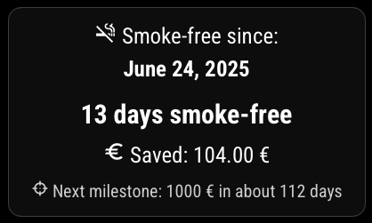

# 🧯 MMM-SmokeFree

**A MagicMirror² module to track your smoke-free days and money saved.**

`MMM-SmokeFree` helps you visualize your progress after quitting smoking — directly on your MagicMirror.  
It shows:
- the number of smoke-free days
- estimated money saved 💶
- your next savings milestone (e.g., 1000 €)
- a motivational quote

You can choose between a fun **fridge magnet-style** and a minimal **text layout**.

---

## 📸 Preview

| Magnet Style | Simple Style |
|--------------|--------------|
|  |  |

---

## ⚙️ Installation

```bash
cd ~/MagicMirror/modules
git clone https://github.com/ChrisF1976/MMM-SmokeFree.git
cd MMM-SmokeFree
npm install
```

## ⚙️ Update

```bash
cd ~/MagicMirror/modules/MMM-SmokeFree
git pull
npm install
```

## 🛠️ Configuration
Add the module to your config.js:
```js
{
  module: "MMM-SmokeFree",
  position: "top_center",
  config: {
    startDate: "2024-12-01",     // the date you quit smoking
    cigarettesPerDay: 20,        // how many cigarettes you used to smoke per day
    pricePerPack: 8.0,           // price of one pack in EUR
    cigarettesPerPack: 20,       // cigarettes per pack
    motivationalText: true,      // show motivational quotes?
    style: "magnet",             // choose between "magnet" or "simple"

    currency: "€",               // or "$", "£", etc.
    currencyIcon: "mdi:currency-eur", // Icons: https://icon-sets.iconify.design/
    
    motivationalText: true,      // activate or deactivate this text line. Use true/false.
    
    showMilestone: true,         // activate or deactivate this text line. Use true/false.
    milestoneAmount: 500,        // adjust the amount in the config now.
  }
},
```

## 🎨 Styles
You can choose between two styles:
### magnet
- Circular 3D look
- Gradient background and shadows
- Designed to look like a fridge magnet

### simple
- Clean and elegant text layout
- Perfect for minimalist setups


## 🌍 Language Support

The module auto-detects your MagicMirror system language. Supported languages:

- 🇬🇧 English
- 🇩🇪 German
- 🇫🇷 French
- 🇳🇱 Dutch

## 📄 License

MIT – Free to use, modify, and share.
**And hey — great job staying smoke-free. Keep it up! 🚭**


